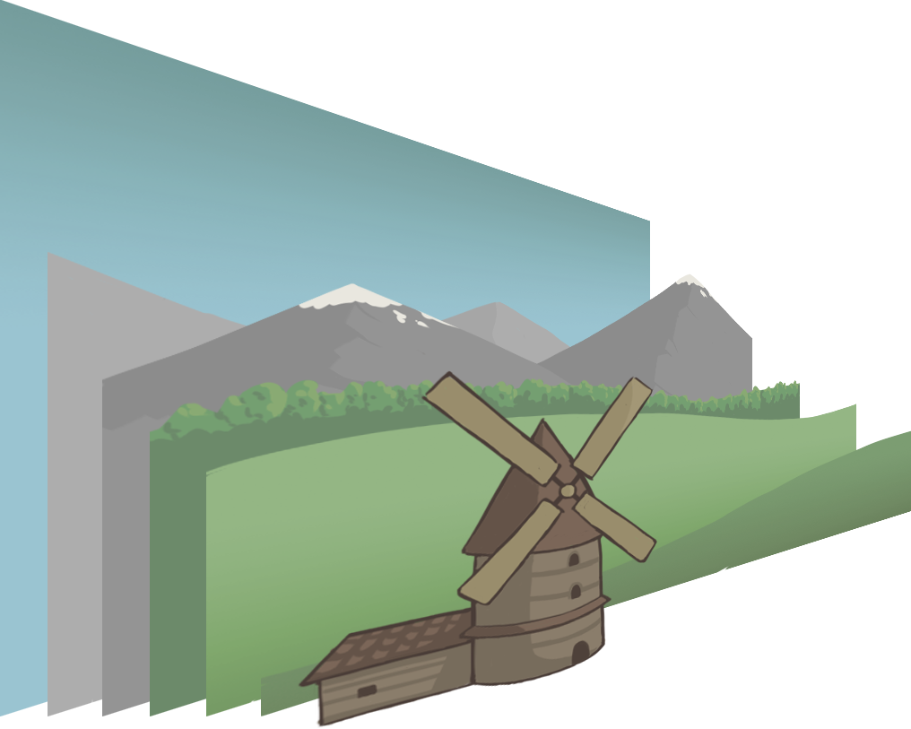

# Parallax effect with pure javascript

Realization of [parallax effect](https://en.wikipedia.org/wiki/Parallax) for web page using **scroll** 
or **mouse movement**.

The effect of parallax on the web page is achieved by smart choice of speeds to move each individual image layer 
or individual elements of the page. Changing the position of the element can be done by moving the mouse or 
scrolling the page. And the difference in the speed of movement of the elements is determined by the distance of 
the layer relative to the viewer.

## Image preparation
First you have to choose a picture in which you can trace the depth. In this picture, for example, the mountains are 
farther away than the mill.

In this way we can split the picture into separate layers. It is worth saying that in this case you need to extend the 
length of the picture, so that when you move there are no gaps between the images. You can see that the forest layer is 
extended down to the end of the screen.

## Mouse parallax

### Moving along the x-axis
When we move the mouse to the right, all the layers slide to the left, and when we move to the left,
layers slide to the right.
The speed of the layers farther away from the viewer is faster than the speed of the closer layers.

### Moving along the y-axis
Layers move in the direction of mouse movement. The speed of the distant layers is greater.

 ### Moving along the z-axis. Enlargement of the image
When the cursor moves to the right, the layers to the right of the center of the screen are 
enlarged and those to the left are reduced. 
When the cursor moves to the left, the layers to the left are enlarged.

Layers closer to the user are enlarged more.

# Rotation
When the cursor moves to the right, all layers rotate clockwise, when to the left, 
they rotate counterclockwise.

Layers that are closer have a higher rotation speed.

## Scroll parallax
#TODO

## How to run
Just download the repository and run any html file from the [pages folder](pages).